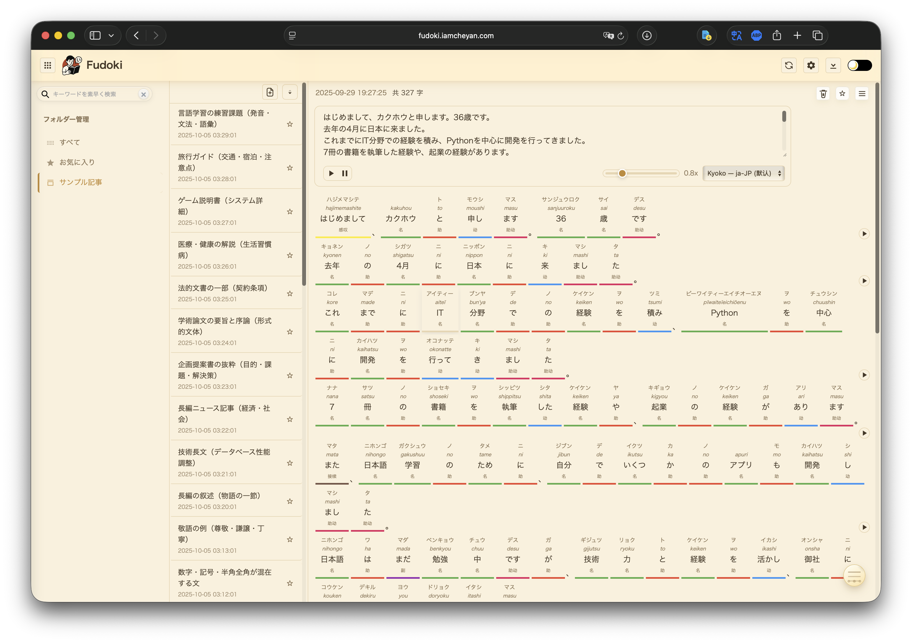

# YomiKiku-an（読み聞く庵）

> 日本語を「見える化」する Web ツール（テキスト解析＆音声読み上げ）
>
> An interactive Japanese text analysis and speech synthesis web app
>
> 让日语结构可视化的 Web 工具（文本分析与语音朗读）



---

## English

### Overview
YomiKiku-an is a browser-based tool for reading and listening practice in Japanese. It segments text, shows part-of-speech tags and readings, and reads text aloud via the Web Speech API.

### Features
- **Markdown Editor**: Built-in EasyMDE markdown editor for rich text formatting while maintaining full Japanese analysis capabilities.
- Text analysis: Kuromoji.js-based segmentation, POS tags, kana and romaji.
- Speech synthesis: play word/line/all; speed 0.5–2.0; voice selection.
- Playback controls: separate Pause/Resume; Play button shows a stop icon while playing.
- Instant setting changes: changing voice or speed during playback pauses first and then resumes near the current position; settings persist in localStorage.
- Dictionary: JMdict integration; click a word card to view translations.
- Documents: multiple documents, autosave, quick switching.
- UI: dark mode, toggle display options, multilingual interface, draggable toolbar.
- Mobile: on small screens (≤480px) the header speed slider and voice select are compressed in width; left-aligned play buttons and right-aligned controls.

### Usage
Online: https://leigaorobot.github.io/yomikiku-an

Local:
```bash
python -m http.server 8000
# then open http://localhost:8000
```

### Part-of-Speech Colors
|  | POS |
|---|---|
| 🟢 | Noun |
| 🔵 | Verb |
| 🟠 | Adjective |
| 🟣 | Adverb |
| 🔴 | Particle |
| 🟡 | Interjection |

### Markdown Support

The app now features a built-in **EasyMDE** markdown editor that replaces the standard textarea while maintaining full compatibility with Japanese analysis features:

- **Rich text editing**: Use the toolbar for quick formatting (bold, italic, headers, lists, quotes, links, images)
- **Live preview**: Side-by-side markdown preview mode
- **Full-screen mode**: Distraction-free writing experience
- **Syntax highlighting**: Visual markdown syntax support
- **Seamless integration**: Japanese analysis works automatically on your markdown content

For detailed documentation about the markdown integration, see [MARKDOWN_README.md](./MARKDOWN_README.md).

### Development
```
yomikiku-an/
├── index.html
├── static/
│   ├── main-js.js
│   ├── segmenter.js
│   ├── styles.css
│   └── libs/
│       ├── kuromoji.js
│       └── dict/
│           ├── *.dat.gz
│           └── jmdict_*.json
└── README.md
```

- Update theme colors in `static/styles.css` via CSS variables.
- Place updated JMdict data under `static/libs/dict/`.

### License and Third-party
- MIT License
- Kuromoji.js — Apache License 2.0
- JMdict — Creative Commons Attribution-ShareAlike 3.0

### Contributing and Feedback
Pull requests are welcome. For issues and feature requests, use GitHub Issues: https://github.com/LeiGaoRobot/yomikiku-an/issues

---

## 日本語

### 概要
読み聞く庵（YomiKiku-an）はブラウザで動作する日本語の読解・リスニング練習ツールです。Kuromoji.js による分かち書き、品詞、読み（かな・ローマ字）を表示し、Web Speech API で朗読します。

### 主な機能
- **Markdown エディタ**：日本語解析機能を保ちながら、リッチテキスト編集ができる EasyMDE エディタを搭載。
- 形態素解析：分割、品詞、読み（かな／ローマ字）。
- 音声合成：単語・行・全文の再生、話速 0.5–2.0、音色選択。
- 再生制御：一時停止／再開は専用ボタン。再生中は再生ボタンが停止アイコンになります。
- 設定の即時反映：再生中に音色や話速を変更すると、一度停止してから現在位置付近から新設定で再開します。設定は localStorage に保存されます。
- 辞書：JMdict と連携、単語カードのクリックで訳語を表示。
- 文書管理：複数文書、自動保存、簡易切替。
- UI：ダークモード、表示切替、多言語 UI、ツールバーのドラッグ。
- モバイル：480px 以下では速度スライダーと音色選択の幅を縮小。左に再生ボタン、右に設定。

### 使い方
オンライン：https://leigaorobot.github.io/yomikiku-an

ローカル：
```bash
python -m http.server 8000
# ブラウザで http://localhost:8000 を開く
```

### 品詞色分け
| 色 | 品詞 |
|---|---|
| 🟢 | 名詞 |
| 🔵 | 動詞 |
| 🟠 | 形容詞 |
| 🟣 | 副詞 |
| 🔴 | 助詞 |
| 🟡 | 感動詞 |

### Markdown サポート

標準的なテキストエリアを **EasyMDE** Markdown エディタに置き換えました。日本語解析機能とは完全に互換性があります：

- **リッチテキスト編集**：ツールバーでクイック書式設定（太字、斜体、見出し、リスト、引用、リンク、画像）
- **ライブプレビュー**：サイドバイサイドの Markdown プレビューモード
- **全画面モード**：集中執筆環境
- **シンタックスハイライト**：視覚的な Markdown 構文サポート
- **シームレスな統合**：Markdown コンテンツで日本語解析が自動的に機能

Markdown 統合の詳細なドキュメントは [MARKDOWN_README.md](./MARKDOWN_README.md) をご覧ください。

### 開発情報
- テーマカラー：`static/styles.css` の CSS 変数を編集。
- JMdict データ：`static/libs/dict/` に配置。

### ライセンスと利用ライブラリ
- MIT License
- Kuromoji.js — Apache License 2.0
- JMdict — Creative Commons Attribution-ShareAlike 3.0

### 貢献・フィードバック
Issue／PR を歓迎します。https://github.com/LeiGaoRobot/yomikiku-an/issues

---

## 中文

### 概述
YomiKiku-an（読み聞く庵）是一款基于浏览器的日语阅读与听力练习工具。使用 Kuromoji.js 进行分词与词性标注，显示假名和罗马音，并通过 Web Speech API 朗读文本。

### 功能
- **Markdown 编辑器**：内置 EasyMDE markdown 编辑器，支持富文本格式，同时保持完整的日语分析能力。
- 文本分析：分词、词性、假名与罗马音。
- 语音合成：按单词/按行/全文播放；语速 0.5–2.0；音色选择。
- 播放控制：暂停/继续为独立按钮；播放中播放按钮显示"停止"图标。
- 即时设置生效：播放中更改语速或音色，会先暂停再在当前段附近按新设置续播；设置持久化到 localStorage。
- 词典：整合 JMdict；点击词卡查看释义。
- 文档：多文档管理、自动保存、快速切换。
- 界面：暗色模式、显示切换、多语言 UI、工具栏可拖拽。
- 移动端：≤480px 时压缩头部语速滑条与音色下拉宽度；左侧按钮、右侧设置。

### 使用
在线版：https://leigaorobot.github.io/yomikiku-an

本地运行：
```bash
python -m http.server 8000
# 浏览器访问 http://localhost:8000
```

### 词性颜色
| 颜色 | 词性 |
|---|---|
| 🟢 | 名词 |
| 🔵 | 动词 |
| 🟠 | 形容词 |
| 🟣 | 副词 |
| 🔴 | 助词 |
| 🟡 | 感叹词 |

### Markdown 支持

应用现在内置了 **EasyMDE** markdown 编辑器，替换了标准的 textarea，同时完全保持日语分析功能的兼容性：

- **富文本编辑**：使用工具栏快速格式化（粗体、斜体、标题、列表、引用、链接、图片）
- **实时预览**：并排 markdown 预览模式
- **全屏模式**：专注写作体验
- **语法高亮**：可视化 markdown 语法支持
- **无缝集成**：日语分析功能自动作用于 markdown 内容

有关 markdown 集成的详细文档，请参阅 [MARKDOWN_README.md](./MARKDOWN_README.md)。

### 开发信息
- 主题颜色：编辑 `static/styles.css` 中的 CSS 变量。
- JMdict 数据：放置在 `static/libs/dict/`。

### 许可与第三方
- MIT License
- Kuromoji.js — Apache License 2.0
- JMdict — Creative Commons Attribution-ShareAlike 3.0

### 贡献与反馈
欢迎 Issue／PR：https://github.com/LeiGaoRobot/yomikiku-an/issues

---

## Appendix (Brand & History)

### Brand
<div align="center">

Made with ❤️ for Japanese language learners worldwide

世界中の日本語学習者のために ❤️ を込めて

为全世界的日语学习者用心打造 ❤️

</div>

### Star History

[](https://star-history.com/#LeiGaoRobot/yomikiku-an&Date)