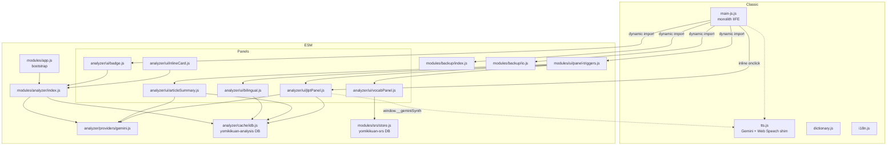

# Architecture — YomiKiku-an

Whirlwind tour for newcomers (10 minutes). This doc snapshots the current system; prefer `CLAUDE.md` as the authoritative contributor guide when they conflict.

## 1. Load order

```
index.html
├─ classic <script> (order-dependent, sync)
│    migrate-legacy-keys.js
│    libs/easymde, kuromoji, kuroshiro, dict service, segmenter
│    js/dictionary.js, ui-utils.js, tts.js, i18n.js
│    main-js.js                  ← IIFE with ~8800 lines, the "monolith"
│    config.js                   ← gitignored local dev config (optional; 404 silent)
│    <inline IIFE>                ← syncs YOMIKIKUAN_CONFIG → localStorage + sets __yomikikuanKeyStatus
└─ <script type="module">
     modules/app.js              ← ESM bootstrap, runs AFTER classic scripts
```

`config.js` is special-cased in the SW as **networkFirst** — rotating the API key just needs a reload, no `CACHE_VERSION` bump.

## 2. Module dependency graph



Solid arrows = direct module imports. Dotted = runtime `window.*` bridge.

## 3. Storage layout

| Surface | Where | Shape | Eviction |
|---|---|---|---|
| `localStorage.yomikikuan_texts` | browser | stringified `[{ id, content, folder, locked, createdAt, … }]` | manual |
| `localStorage.yomikikuan_activeId` | browser | doc id string | manual |
| `localStorage.yomikikuan_gemini_api_key` | browser | opaque string; overwritten by `config.js` sync IIFE on every load | manual |
| `localStorage.yomikikuan_*` (theme, lang, fontSize, rate, voiceURI, ruby_mode, bilingual_mode, …) | browser | strings | manual |
| IDB `yomikikuan-tokens` | browser | kuromoji token cache | 60d TTL |
| IDB `yomikikuan-tts` | browser | `{ blob: Blob }` keyed by `voiceName\|style\|text` | 30d TTL + LRU-50 (in-memory mirror in tts.js) |
| IDB `yomikikuan-analysis` | browser | unified analyzer cache with `providerId` namespaces: `gemini` / `jlpt` / `article-summary` / `translate-zh` | 30d TTL + LRU-500 |
| IDB `yomikikuan-srs` | browser | `vocab[]` + `mistakes[]` — user learning data (SM-2 fields) | **NONE** — user-owned |
| CacheStorage `yomikikuan-cache-v{N}` | browser | HTTP responses | bumped on every asset change; older buckets swept on activate |
| File `yomikikuan-backup-YYYYMMDD-HHMMSS.json` | downloaded | `{ app, version: 3, createdAt: ISO, data: { documents, activeId, settings, srs } }` | n/a (external) |

## 4. Playback pipeline boundary

The playback state machine (`PLAY_STATE`, `isPlaying`, `playSegments`, `speakWithPauses`, `currentSegments`, `currentUtterance`, `setHeaderProgress`, …) is deliberately an **IIFE-local** inside `main-js.js`. It is **not** exported on `window`.

`tts.js` offers four narrow hooks used by the rest of the codebase:

- `window.speechSynthesis` **shim** — transparently routes `SpeechSynthesisUtterance.speak` to Gemini TTS or native Web Speech
- `window.__geminiSynth(text, voiceName)` — returns a `blob: URL` for Gemini WAV audio
- `window.__prefetchGeminiTTS(text)` — fire-and-forget read-ahead
- `window.__applyLiveRate(r)` — mutates the currently playing `Audio.playbackRate` for instant speed changes

Anything else that wants to influence playback must go through these — **do not** re-export `playAllText` / `playSegments` on `window`.

Gemini safety-filter false positives are handled at two layers:
1. `splitTextByPunctuation` pre-filters segments with no `/[\p{L}\p{N}]/u` content
2. `playSegments.onerror` auto-advances on `PROHIBITED_CONTENT|SAFETY|no audio in response`

## 5. Panel conventions

The four header panels (JLPT, article summary, vocab, bilingual) share a uniform shape:

```
static/js/modules/analyzer/ui/<name>.js
├─ (imports cache/idb.js for persistence)
├─ injectCss()                   ← <style> tag, idempotent via window flag
├─ buildPrompt(...)              ← Gemini prompt string
├─ callGemini(prompt, signal)    ← 1 retry on 429/5xx, abortable
├─ parseJson(raw)                ← strips ```json fences tolerantly
├─ render*(container, payload)   ← DOM build
├─ mountPanel(ctx) / unmountPanel()
└─ self-register window.__yomikikuanOpen<Name>()
```

Header button → `modules/ui/panel-triggers.js` → lazy-`import()` the panel module → call its `__yomikikuanOpen*`. Buttons use `aria-pressed` for toggles, modal backdrops close on outer click + Esc.

## 6. Window-global cheat sheet

See `CLAUDE.md` "Classic-script globals" for the authoritative list. Shortlist:

**Stable**: `YomikikuanDict`, `YomikikuanAnalyzer`, `YomikikuanRuby`, `YomikikuanGetText`, `YomikikuanFormat`, `YomikikuanEvents`, `TTS`, `setTTSEngine`, `getGeminiApiKey`, `setGeminiApiKey`.

**Internal (`__yomikikuan*`)**: `AnalyzeLine`, `RefreshDifficultyBadge`, `OpenJLPT`, `OpenArticleSummary`, `OpenVocab`, `ToggleBilingual`, `BilingualState`, `AddVocab`, `AddMistake`, `DumpSrs`, `RestoreSrs`, `KeyStatus`.

**TTS (`__` prefix)**: `__geminiSynth`, `__prefetchGeminiTTS`, `__applyLiveRate`.

## 7. How to add a new AI panel

1. Create `modules/analyzer/ui/<name>.js` following the Panel convention (§5).
2. Register a toolbar button in `index.html` next to the existing icon-only `.theme-icon-btn` buttons.
3. Add an entry to `PANEL_MODULES` in `modules/ui/panel-triggers.js` with `{ btnId, modulePath, openFn, logTag }`.
4. If the panel writes user data, go through `srs/store.js` (SM-2) or `cache/idb.js` (TTL cache), never open a new IDB.
5. If the panel needs persistence across browsers, extend `backup/index.js` (bump schema version).
6. Bump `CACHE_VERSION` in `service-worker.js` before shipping.

## 8. Testing

Each module with non-trivial pure logic has a sibling `*.test.html`. Open directly in browser at `http://localhost:8000/…/<name>.test.html`. Assertions print PASS/FAIL inline. Zero deps, no npm install, no build.

Current fixtures: `analyzer/cache/idb.test.html`, `analyzer/local/difficulty.test.html`, `analyzer/local/syntax.test.html`, `analyzer/local/tokenizer.test.html`, `srs/store.test.html`.
